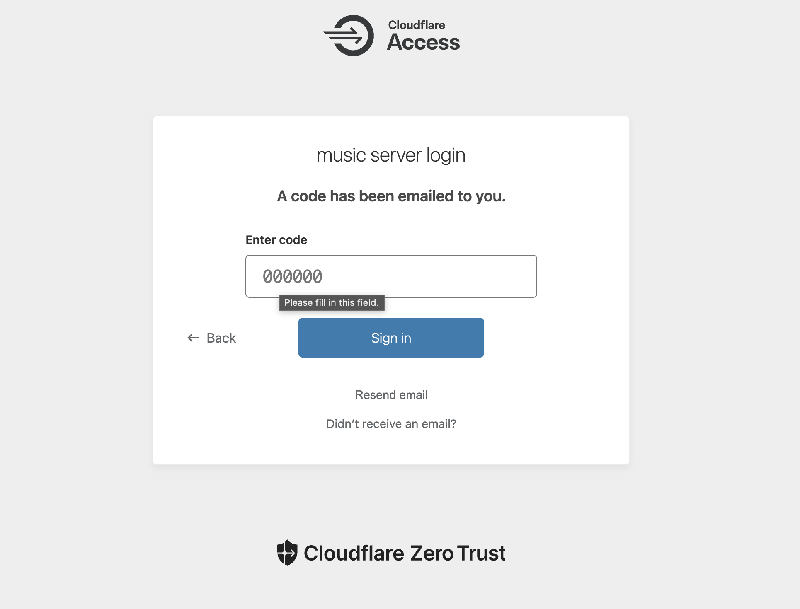
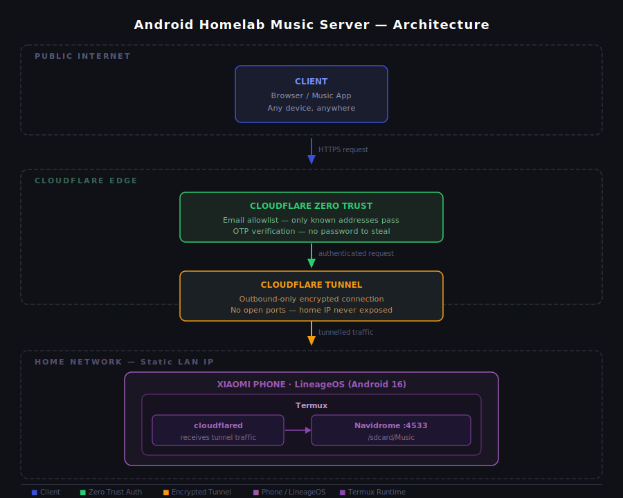

# Android Homelab Music Server

Turned an old Xiaomi phone into a self-hosted music streaming server — accessible from anywhere, secured behind Cloudflare Zero Trust, with no open ports on the home network and near-zero running cost.

This isn't a "buy a Raspberry Pi and follow a guide" project. The hardware was already sitting unused. The goal was to see how far a spare Android phone could go as real server infrastructure — and to do it with proper security, not just "it works."

---

## How It Looks

**Navidrome running in Termux**


**Cloudflare tunnel — healthy status**


**Zero Trust access policy**


**OTP login wall**


**Navidrome music library**


---

## The Stack

| Layer | Technology |
|---|---|
| Hardware | Xiaomi phone (spare) |
| OS | LineageOS — Android 16 |
| Runtime | Termux |
| Music server | Navidrome |
| Tunnel | Cloudflare Tunnel (free) |
| Auth | Cloudflare Zero Trust (free) |
| Domain | Custom domain (~₹100 one-time) |

**Monthly running cost: ₹0**

---

## Architecture



The core idea: `cloudflared` opens an outbound encrypted connection to Cloudflare's edge. The phone never accepts an inbound connection. The router has zero port forwarding rules. The home IP never appears in any DNS record.

Every external request hits Cloudflare Zero Trust first — email allowlist + OTP — before it ever reaches the application. Navidrome sits behind that with its own credentials. Two independent walls, neither aware of the other.

```
Client (anywhere)
    │
    ▼
Cloudflare Zero Trust  ←  email allowlist + OTP
    │
    ▼
Cloudflare Tunnel      ←  outbound-only, no open ports
    │
    ▼
Xiaomi Phone — LineageOS — Termux — Navidrome :4533
```

Full breakdown → [ARCHITECTURE.md](./ARCHITECTURE.md)

---

## Why Not Just Use Spotify

₹119/month with ads on the free tier. That's ₹1,428/year for a library I don't own, on infrastructure I don't control. Three years in, this project costs ₹300 - ₹500 total. Spotify costs ₹4,284.

More importantly — owning the server means owning the files, the access, and the experience.

---

## The Interesting Problems

This project wasn't just config files. A few things that needed real debugging:

**Android 16 Signal 31 (SIGSYS)** — Navidrome kept dying on startup with no useful error. Traced it to Android 16 tightening its seccomp filter. Navidrome binding to `0.0.0.0` triggered a blocked syscall path. Fix was binding to `127.0.0.1` instead — which is actually more correct for this setup anyway since cloudflared connects to localhost.

**Phantom Process Killer** — Android 12+ kills background child processes of apps not in the foreground. Termux spawns Navidrome and cloudflared as child processes — they were dying silently whenever the screen turned off. Fixed via ADB.

**Static IP without losing the current IP** — setting a DHCP reservation requires seeing the phone's IP while simultaneously accessing the router admin panel. Solved with scrcpy — mirrored the phone to PC, had both visible at once.

Full details in the [setup guides](./setup/).

---

## Security Model

Four independent layers, each of which must pass before a user reaches any data:

1. **No open ports** — nothing for bots to scan or connect to
2. **Cloudflare Zero Trust** — email allowlist + OTP at the edge, before the tunnel
3. **Navidrome credentials** — username + password still required after Cloudflare
4. **Registration disabled** — no self-signup, accounts are admin-created only

Full threat model → [SECURITY.md](./SECURITY.md)

---

## Setup

Follow in order — each step assumes the previous is done.

1. [Bootloader Unlock](./setup/01_bootloader_unlock.md)
2. [Flash LineageOS](./setup/02_flash_lineageos.md)
3. [Termux Setup](./setup/03_termux_setup.md)
4. [Fix Phantom Process Killer](./setup/04_background_process.md)
5. [Static IP](./setup/05_static_ip.md)
6. [Navidrome Install](./setup/06_navidrome_install.md)
7. [Android 16 Signal 31 Fix](./setup/07_android16_signal_fix.md)
8. [Cloudflare Tunnel & Zero Trust](./setup/08_cloudflare_tunnel.md)
9. [Start Script](./setup/09_start_server_script.md)

---

## Docs

- [ARCHITECTURE.md](./ARCHITECTURE.md) — decisions, trade-offs, lessons learned
- [SECURITY.md](./SECURITY.md) — threat model and layered auth
- [NETWORKING.md](./NETWORKING.md) — how the tunnel works, Zero Trust policy, Signal 31
- [HARDWARE.md](./HARDWARE.md) — why the phone beat buying new hardware